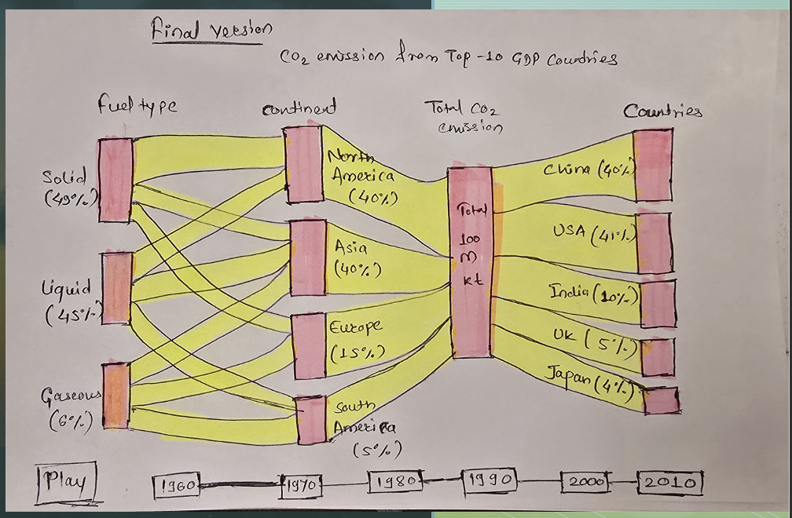

# CO2-Emissions-Analytics-Sankey-Visualization
# Global CO2 Emissions Visualization (1960–2010)

## Abstract
This project investigates how global CO2 emissions have changed across continents and countries over the past six decades. Using the World Bank’s World Development Indicators dataset, the aim was to create a clear and engaging visualization that captures long term shifts in emissions. After thorough data cleaning and exploration, an animated Sankey diagram was developed to show how emissions flow from continents to countries across each decade.

The visualization reveals consistent growth in global emissions since 1960 with early dominance by North America and Europe, followed by sharp increases from Asia especially China and India from the 1990s onward. This animated format effectively highlights structural transitions and geographic shifts, illustrating how Asia has become the leading contributor in recent decades.

---

## Design Process

The development of the visualization followed a structured design and investigative process.

### 1. Design Sketch & Data Investigation
Before implementation, the project began with investigating available indicators related to CO2 emissions within the dataset. A hand drawn sketch was created to visualize the potential flow of data and layout of the final graph.

**Key steps in this phase included:**
* **Source Identification:** CO2 emissions were categorized by fuel type: **Solid Fuels**, **Liquid Fuels**, and **Gaseous Fuels**.
* **Data Feature Engineering:** A custom column was created to map each country to its respective continent, enabling a high level geographic grouping.
* **Animation Strategy:** The design plan included a decade based timeline to create an animated transition, allowing users to observe trends over time rather than a static snapshot.

---

## Final Visualization

The final result is a live, animated Sankey diagram that tracks the flow of CO2 emissions from Fuel Type $\rightarrow$ Continent $\rightarrow$ Total Emissions $\rightarrow$ Top Countries.

### Decade-by-Decade Analysis

The animation reveals distinct trends for each decade:

**1. Decade 1960**
* **Fuel Mix:** Solid fuels dominate (43.3%), followed by liquid fuels.
* **Geographic Lead:** North America leads emissions, followed by Europe and Asia.
* **Global Total:** Total emissions are at **57.5M kt**.
* **Top Emitters:** The USA is the top emitter by a significant margin (57%), followed by the UK.

**2. Decade 1970**
* **Fuel Mix:** Liquid fuels overtake solid fuels, reaching 50%.
* **Geographic Shift:** Asia begins to emerge, contributing 25% of emissions.
* **Country Trends:** China and Japan begin rising; the UK’s share decreases.

**3. Decade 1980**
* **Fuel Mix:** Solid and liquid fuels represent nearly equal shares.
* **Geographic Shift:** Asia catches up to Europe, reaching 31%.
* **Global Total:** Total emissions near the **100M kt** mark.
* **Country Trends:** China’s share grows to 20%; India appears in the top ranks.

**4. Decade 1990**
* **Fuel Mix:** Solid fuels peak; gaseous fuels begin to grow.
* **Geographic Shift:** Asia moves closer to North American emission levels.
* **Global Total:** Significant rise in total emissions to **125M kt**.
* **Country Trends:** China and India rise rapidly, while the USA's relative share drops.

**5. Decade 2000**
* **Fuel Mix:** Solid fuels dominate again with 50%; liquid fuels sit at 34%.
* **Geographic Shift:** Asia becomes the top emitting continent for the first time.
* **Global Total:** Total emissions cross the **150M kt** level.
* **Country Trends:** China nearly matches the USA; India climbs to rank #3.

**6. Decade 2010**
* **Fuel Mix:** Solid fuels remain strong.
* **Geographic Shift:** Asia contributes over **60%** of global emissions.
* **Country Trends:** China overtakes the USA as the world's top emitter.
* **Global Total:** Total emissions show a decrease for the first time, settling at **137M kt**.

---

## Conclusion

The visual analysis highlights four major historical shifts:
* **Eastward Shift:** Global emissions have shifted heavily from the West (North America/Europe) to the East (Asia).
* **Fuel Trends:** Solid fuels have remained dominant despite a temporary surge in liquid fuels (1970s).
* **New Powerhouses:** The rapid industrialization of China and India has reshaped the global emissions landscape.
* **Volume Increase:** Over the span of six decades, total tracked emissions rose from **57M kt** to **137M kt**.
